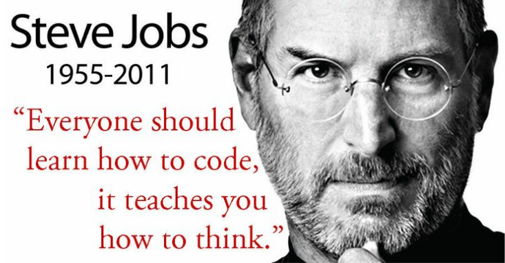

# 1.- Introducció

La programació és com donar instruccions molt precises a un ordinador perquè faci el que volem: 
* resoldre un càlcul
* mostrar un missatge
* guardar informació
* fer funcionar una aplicació
* etc...

Gràcies a la programació s'han creat totes les aplicacions que fem servir cada dia com: WhatsApp, YouTube, els navegadors web, jocs, aplicacions bancàries o fins i tot els semàfors i els caixers automàtics.


## 1.1. Llenguatges de programació

Per fer-ho, s’utilitzen llenguatges de programació, com el Python, que són maneres especials d’escriure aquestes instruccions.


*[Font](https://www.swhosting.com/ca/blog/principals-llenguatges-de-programacio-web)*


**Python** és conegut per la seva sintaxi clara i llegible, cosa que facilita l'escriptura i el manteniment del codi. Això, juntament amb la seva extensa biblioteca estàndard i una activa comunitat de desenvolupadors, el converteix en una excel·lent opció per al desenvolupament web.

[Versions de Python](https://devguide.python.org/versions/ "Versions de Python")


## 1.2. Exemple de Recepta de cuina


La programació és molt semblant a escriure una recepta de cuina, però en un llenguatge que l’ordinador pot entendre.

Quan cuinem, donem instruccions clares i ordenades perquè qui segueixi la recepta obtingui el plat desitjat. De la mateixa manera programar vol dir donar ordres molt precises a un ordinador perquè faci exactament el que volem. Per exemple, imagina que volem fer una truita de patates:

**Recepta:** Truita de patates
**Ingredients:**
- 2 patates
- Mitja ceba
- Oli
- 4 ous

**Procediment:**
1. Pela 2 patates.
2. Talla les patates a rodanxes fines.
3. Pela i talla mitja ceba.
4. Escalfa oli en una paella.
5. Posa les patates i la ceba a la paella.
6. Cou a foc mitjà durant 15 minuts fins que siguin tendres.
7. Bat 4 ous en un bol.
8. Treu l’oli de les patates i afegeix-les al bol amb els ous.
9. Barreja-ho tot bé.
10. Torna-ho a posar a la paella.
11. Cuina 3 minuts per un costat.
12. Dona la volta a la truita.
13. Cuina 2 minuts més.
14. Treu la truita i serveix-la.
    
Aquesta recepta funciona perquè cada pas és clar i ordenat.


## 1.3. Recepta en Python

Veiem com quedaria la recepta de la truita de patates en Python:

```Python
def fer_truita_de_patates():
    patates = ["patata1", "patata2"]
    ceba = "mitja ceba"
    oli = "oli d'oliva"
    ous = 4

    print("1. Pelar les patates.")
    print("2. Tallar les patates a rodanxes fines.")
    print("3. Pelar i tallar la ceba.")
    print("4. Escalfar oli en una paella.")
    print("5. Afegir patates i ceba a la paella.")
    print("6. Coure durant 15 minuts.")
    print(f"7. Batre {ous} ous en un bol.")
    print("8. Retirar l'oli de la paella.")
    print("9. Afegir les patates i la ceba als ous batuts.")
    print("10. Barrejar bé.")
    print("11. Abocar la barreja a la paella.")
    print("12. Cuinar 3 minuts.")
    print("13. Donar la volta a la truita.")
    print("14. Cuinar 2 minuts més.")
    print("15. Servir la truita al plat.")

# Cridem la funció per fer la truita
fer_truita_de_patates()
```

Aquest petit programa no cuina realment (els ordinadors no tenen paella!), però mostra clarament com podem traduir una seqüència
d'instruccions a codi. 

Així com un cuiner segueix una recepta, l’ordinador segueix el codi.

I si un pas és incorrecte o està fora d’ordre, el "plat" final —el resultat del programa— pot sortir malament.


## 1.4. Per què el llenguatge Python?

Python és un dels llenguatges de programació més utilitzats al món. I és ideal per començar perquè:

* Té una escriptura senzilla i entenedora, molt propera al llenguatge natural.
* Es fa servir en moltes àrees: pàgines web, ciència, educació, intel·ligència artificial, videojocs...
* Té una gran comunitat, amb molts recursos gratuïts i tutorials per ajudar a aprendre.


**Exemple:** Escriure en un fitxer `hola.py` el text `print("Hola Vallbona!!!")` en Python mostra el text a la pantalla. Això ja és programar!

Contingut de `hola.py`:
```Python
print("Hola Vallbona!!!")
```

Una vegada fet només s'ha d'executar al terminal per exemple:
```bash
python3 hola.py
```


L'important de la programació són els conceptes que anirem treballant donat que tot programa es succeptible de traduir-se a altres llenguatgues de progrmació. A l'igual que una recepta o un llibre es poden traduïr a molts idiomes.


## 1.5. Què aprendrem quan aprenem a programar?

Al començar a programar, aniràs aprenent:

* Com pensar pas a pas per resoldre problemes (pensament lògic).
* Com crear petits programes útils o divertits.
* Com entendre els errors i corregir-los (provar, equivocar-se i aprendre).
* Com funciona un ordinador de manera bàsica.

Donat que només a base de picar codi i provar-ho es va aprenent com funciona, això que fem a l'igual quan entrenem el cos en qualsevol esport anem coneixent els nostres límits i capacitats.



Tothom hauria d'apendre a programar, Això t'ensenya a pensar.

* Perquè obre oportunitats laborals. Cada cop hi ha més feina relacionada amb la tecnologia.
* Perquè desenvolupa el pensament crític i la creativitat.
* Perquè pots crear coses útils: des d’una petita eina per calcular despeses fins a un joc o una pàgina web.


## 1.6. Resum

Programar no és només per informàtics. És una eina que pot fer servir qualsevol persona, com qui aprèn a fer vídeos, editar fotos o cuinar. 

Amb ganes i pràctica, tu també pots programar.

## 1.7 Entorn de programació

Recomanem programar amb **Visual Studio Code**, encara que hi ha molts IDE (Entorn de desenvolupament), aquest és utilitzat per molts desenvolupadors professionals i inclou moltes extensions i s'utilitza per molts llenguatges.
[Guia d'instal·lació de VS Code a Ubuntu](/instal.md#vs-code)
