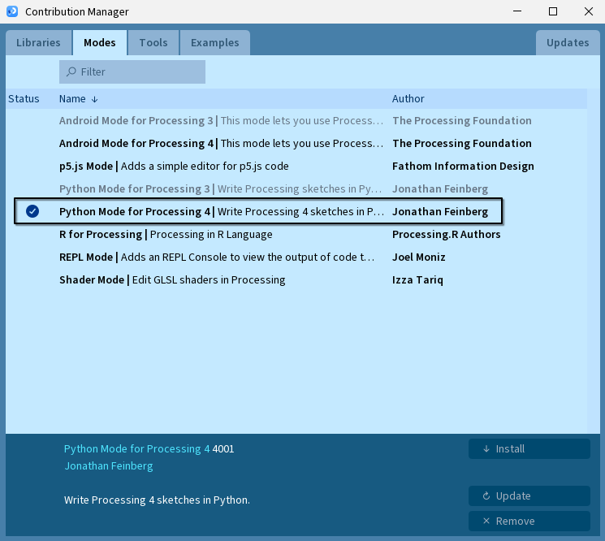

## 1\. Instal·lar Python al teu sistema Ubuntu

Abans de res, assegura't que Python està instal·lat al teu Ubuntu. La majoria de les versions d'Ubuntu ja porten Python preinstal·lat (normalment Python 3), però és bo verificar-ho.

1.  **Obre el terminal** (`Ctrl + Alt + T`).
2.  **Comprova la versió de Python 3:**
    ```bash
    python3 --version
    ```
    Si et mostra una versió (per exemple, `Python 3.12.3`), ja el tens. Si no, o si vols una versió específica, pots instal·lar-lo amb:
    ```bash
    sudo apt update
    sudo apt install python3 python3-pip
    ```
      * `python3-pip` és el gestor de paquets de Python, **molt important** per instal·lar llibreries.


## 2\. Instal·lar VS Codium

    ```bash
    wget -qO - https://gitlab.com/paulcarroty/vscodium-deb-rpm-repo/raw/master/pub.gpg \
    | gpg --dearmor \
    | sudo dd of=/usr/share/keyrings/vscodium-archive-keyring.gpg
    ```

    ```bash
    echo -e 'Types: deb\nURIs: https://download.vscodium.com/debs\nSuites: vscodium\nComponents: main\nArchitectures: amd64 arm64\nSigned-by: /usr/share/keyrings/vscodium-archive-keyring.gpg' \
    | sudo tee /etc/apt/sources.list.d/vscodium.sources
    ```

    ```bash
    sudo apt update && sudo apt install codium
    ```

    
## 3\. Instal·lar l'extensió de Python per a VS Code

Aquesta és l'extensió més important per a Python a VS Code, creada per Microsoft.

1.  **Obre VS Code.**
2.  Ves a la icona de les **Extensions** a la barra lateral esquerra (o prem `Ctrl + Shift + X`).
3.  A la barra de cerca, escriu **"Python"**.
4.  Busca l'extensió anomenada **"Python"** publicada per **Microsoft**.
5.  Fes clic al botó **Instal·lar**.


## 4\. Seleccionar l'intèrpret de Python

Un cop instal·lada l'extensió, VS Code necessita saber quina versió de Python (quin "intèrpret") utilitzarà per executar i depurar el teu codi.

1.  **Obre una carpeta o un fitxer Python (`.py`) a VS Code.**
2.  Mira la **barra d'estat inferior** de VS Code. Hauries de veure una opció que diu alguna cosa com `Python X.X.X` o `No Interpreter Selected`.
3.  Fes clic en aquesta opció (o obre la **Paleta d'ordres** amb `Ctrl + Shift + P` i busca "Python: Select Interpreter").
4.  Apareixerà una llista dels intèrprets de Python detectats al teu sistema. **Selecciona l'intèrpret de Python 3** que vols utilitzar (normalment `Python 3.x.x` o la ruta `usr/bin/python3`).


## 5\. Configurar l'entorn de Desenvolupament (Opcional, però molt recomanat)

Per a projectes Python, és una bona pràctica utilitzar **entorns virtuals**. Això aïlla les dependències del teu projecte i evita conflictes amb altres projectes o amb la instal·lació global de Python.

1.  **Obre la Paleta d'ordres** (`Ctrl + Shift + P`).
2.  Cerca **"Python: Create Environment"** i selecciona-la.
3.  VS Code et preguntarà si vols crear un entorn **`Venv`** o **`Conda`**. Per a la majoria d'usuaris, **`Venv`** és el més comú i el que ja ve amb Python. Selecciona'l.
4.  Et preguntarà quina versió de Python vols usar per a aquest entorn. Tria la que vulguis (per exemple, `Python 3.12.3`).
5.  VS Code crearà l'entorn virtual (normalment en una carpeta anomenada `.venv` dins del teu projecte) i el seleccionarà automàticament com l'intèrpret per al teu espai de treball.


## 6\. Executar i Testejar el teu codi Python

Amb tot això configurat, ja pots començar a programar i testejar.

### **Per Executar:**

1.  Obre el teu fitxer `.py`.
2.  Fes clic al botó **"Run Python File"** (sembla un triangle verd, "play") a la part superior dreta de l'editor, o fes clic dret dins del fitxer i selecciona **"Run Python File in Terminal"**.
3.  El codi s'executarà al terminal integrat de VS Code.

### **Per Depurar (Debugging):**

1.  **Col·loca punts de ruptura (breakpoints):** Fes clic al marge esquerre de la línia de codi on vols que el programa s'aturi (apareixerà un punt vermell).
2.  Ves a la icona **"Run and Debug"** a la barra lateral esquerra (un triangle amb un insecte).
3.  Fes clic al botó **"Run and Debug"** verd.
4.  VS Code iniciarà el programa, s'aturarà als teus punts de ruptura i podràs inspeccionar variables, passar el codi pas a pas, etc.

### **Per Testejar (amb Pytest o Unittest):**

VS Code té un suport integrat per a frameworks de testing de Python com **Pytest** o **Unittest**.

1.  **Instal·la el teu framework de testing** dins del teu entorn virtual (si n'has creat un). Per exemple, per Pytest:
    ```bash
    pip install pytest
    ```
2.  **Configura el testing a VS Code:**
      * Obre la **Paleta d'ordres** (`Ctrl + Shift + P`).
      * Cerca **"Python: Configure Tests"**.
      * Selecciona el teu framework de testing (per exemple, `pytest`).
      * VS Code detectarà els teus fitxers de prova i els llistarà a la vista de "Test Explorer" (la icona de provetes a la barra lateral esquerra).
3.  Des de la vista de **Test Explorer**, pots executar totes les proves, proves individuals, o depurar-les.


## 7\. Instal·lar Processing al teu ordinador

Processing és un entorn gràfic que funciona executant codi en Python i l'utilitzarem per fer tasques fora de l'entorn de consola.

1.  **Obre el terminal** (`Ctrl + Alt + T`).
2. Instal·la processing:

    ```bash
    sudo snap install processing --classic
    ```
3. Obre processing in pulsa a on posa java a adalt a la dreta i selecciona l'opció "gestionar modes".
4. Instal·la el mode de Python

    


Amb aquests passos, el teu VS Code a Ubuntu estarà perfectament optimitzat per a un desenvolupament de Python eficient i professional.

---

<div style="justify-content: space-between;">
<p style="display:inline; display: flex; justify-content: space-between; width: auto;">
       <span><a href="/apunts">Índex</a></span>
       <span><a href="/apunts/1-introduccio.html">1. Introducció →</a></span>
</p>
</div>
